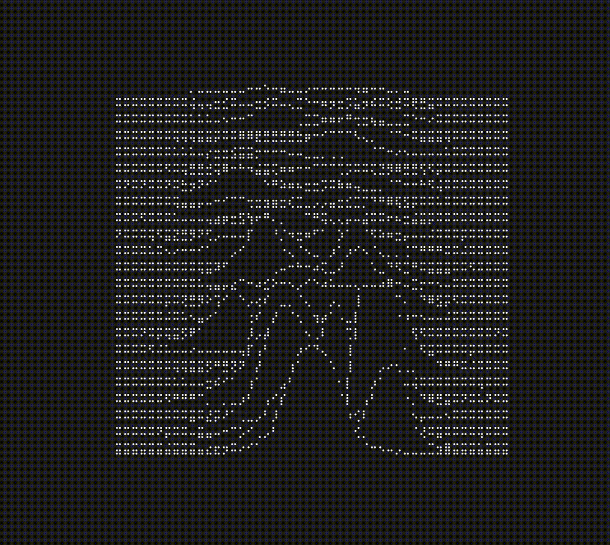

# when

A real-time, music-responsive terminal visualization inspired by the iconic "Unknown Pleasures" album art, built with C++ and Notcurses.



## Features

- **Real-time Audio Analysis**: Captures system audio or microphone input, performs FFT, and distills the spectrum into high-level `AudioFeatures` for consumers.
- **Generative "Pleasure" Animation**: A procedurally generated, multi-layered line animation that reacts to audio energy and beat detection.
- **Pseudo-3D Occlusion**: Nearer lines (lower on the screen) correctly hide farther lines, creating a sense of depth.
- **High-Resolution Braille Rendering**: Uses 8-dot Braille characters via the Notcurses library to achieve high-density, expressive visuals in the terminal.
- **Highly Configurable**: Almost every aesthetic and physical parameter of the animation can be tuned via a simple TOML configuration file.
- **Modular Architecture**: Built on a decoupled, event-driven model that makes it easy to extend and add new animations.

## Tech Stack

- **Language**: Modern C++ (20)
- **Build System**: CMake
- **Terminal UI**: [Notcurses](https://github.com/dankamongmen/notcurses)
- **Audio I/O**: [miniaudio](https://github.com/mackron/miniaudio)
- **FFT**: [kissfft](https://github.com/mborgerding/kissfft)
- **Configuration**: [toml++](https://github.com/marzer/tomlplusplus)
- **CLI Parsing**: [cxxopts](https://github.com/jarro2783/cxxopts)

## Building the Project

### Dependencies

- A C++20 compatible compiler (GCC, Clang, MSVC)
- CMake (3.16+)
- `pkg-config`
- `notcurses` (must be installed on the system, including development headers)

### Build Steps

1.  **Clone the repository:**

    ```sh
    git clone https://github.com/whiteStainX/when.git
    cd when
    ```

2.  **Configure with CMake:**

    ```bash
    cmake -S . -B build -DCMAKE_BUILD_TYPE=Release
    ```

3.  **Build the project:**

    ```sh
    cmake --build build
    ```

4.  **Run the visualizer:**
    ```sh
    ./build/when
    ```

## Configuration

The animation is controlled by the `when.toml` file. The application will look for this file in the directory it is run from.

### Example `when.toml`

```toml
# Select the active animation
[scene]
animation = "pleasure"

# Configure the plane where the animation is drawn
[[animations]]
type = "Pleasure"
plane_rows = 60
plane_cols = 120

# --- Tune the Pleasure Animation --- #

# Smoothing & Responsiveness
pleasure_magnitude_scale = 4.5
pleasure_global_envelope_smoothing = 0.04 # Lower for less sensitivity to volume
pleasure_beat_response = 0.45           # Higher for a faster, stronger beat reaction
pleasure_beat_attack_boost = 2.5

# Line Shape & Ridges
pleasure_min_ridges = 3
pleasure_max_ridges = 5
pleasure_ridge_sigma = 0.035 # Width of the peaks
pleasure_center_band_width = 0.4

# Layout
pleasure_max_lines = 40
pleasure_line_spacing = 3
pleasure_baseline_margin = 4
pleasure_max_upward_excursion = 28
pleasure_max_downward_excursion = 6

# Noise & Jitter
pleasure_ridge_position_jitter = 0.045
pleasure_ridge_magnitude_jitter = 0.35
pleasure_ridge_noise_acceleration = 1.5
pleasure_profile_noise_amount = 0.01
```

### Tunable Parameters

| Parameter                            | Default | Description                                                                                           |
| ------------------------------------ | ------- | ----------------------------------------------------------------------------------------------------- |
| `pleasure_magnitude_scale`           | `4.5`   | General multiplier for audio input magnitude.                                                         |
| `pleasure_global_envelope_smoothing` | `0.08`  | **Responsiveness**. Lower values make the animation less sensitive to overall volume changes.         |
| `pleasure_beat_response`             | `0.0`   | **Beat Reaction**. Higher values make the lines "jump" more dramatically when a beat is detected.     |
| `pleasure_beat_attack_boost`         | `0.0`   | Multiplier for how quickly the animation's energy rises on a beat.                                    |
| `pleasure_profile_smoothing`         | `0.25`  | Smoothing applied to the final line shape. Higher values are more responsive but can be more jittery. |
| `pleasure_min_ridges`                | `3`     | The minimum number of peaks (ridges) on each line.                                                    |
| `pleasure_max_ridges`                | `5`     | The maximum number of peaks (ridges) on each line.                                                    |
| `pleasure_ridge_sigma`               | `0.035` | Controls the width of the peaks. Smaller values create sharper, narrower peaks.                       |
| `pleasure_center_band_width`         | `0.38`  | The normalized horizontal width (0.0-1.0) where peaks can appear.                                     |
| `pleasure_line_spacing`              | `3`     | The vertical distance (in Braille dots) between each line.                                            |
| `pleasure_max_lines`                 | `32`    | The maximum number of lines to draw.                                                                  |
| `pleasure_baseline_margin`           | `4`     | The distance (in Braille dots) from the bottom of the plane to the first line.                        |
| `pleasure_max_upward_excursion`      | `28`    | The maximum number of Braille dots a line can jump upwards from its baseline.                         |
| `pleasure_max_downward_excursion`    | `6`     | The maximum number of Braille dots a line can dip downwards from its baseline.                        |
| `pleasure_ridge_position_jitter`     | `0.045` | The amount of random horizontal drift applied to the peaks.                                           |
| `pleasure_ridge_noise_acceleration`  | `0.0`   | How much faster the random jitter is applied when a beat is active.                                   |
| `pleasure_profile_noise_amount`      | `0.0`   | Adds a small amount of random noise to the final line shape for a grittier look.                      |
